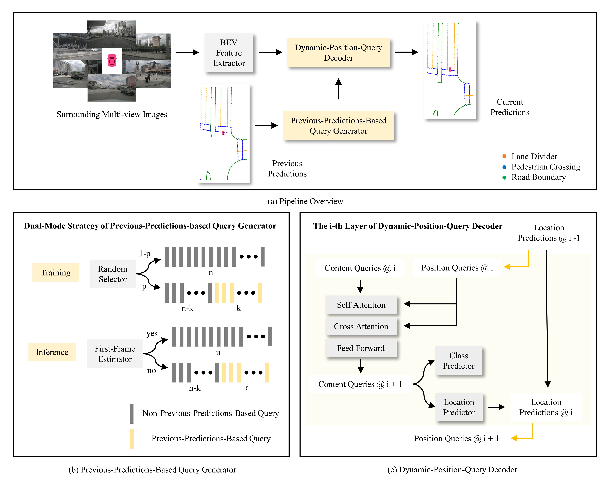

<div align="center">
  <h1>PrevPredMap</h1>
  
  <h3>[WACV 2025] PrevPredMap: Exploring Temporal Modeling with Previous Predictions for Online Vectorized HD Map Construction </h3>
  
  [](https://arxiv.org/abs/2407.17378)
  
</div>

## Introduction
This repository is an official implementation of PrevPredMap.

## Overview

This project introduces a novel temporal modeling framework, named PrevPredMap, which pioneers the use of previous predictions for the construction of online vectorized HD maps. Two essential modules for PrevPredMap are meticulously crafted: the previous-predictions-based query generator and the dynamic-position-query decoder. These modules not only enable PrevPredMap to effectively encode and utilize previous predictions but also ensure robust performance across both single-frame and temporal modes. 

## Visualization

This image displays three common scenarios in autonomous driving, where the camera's field of view is partially obstructed by a large truck, plastic water-filled barriers, and roadside railings, respectively.

## Models

#### nuScenes dataset

| Method  | Backbone | Epoch | Divider | Ped. Crossing | Boundary | mAP | Config | Download |
|:----:|:----:|:-----:|:----:|:----:|:----:|:----:|:----:|:----:|
| PrevPredMap | R50 | 24 | 65.9 | 65.8 | 67.8 | 66.5 | [config](projects/configs/prevpredmap/prevpredmap_nusc_r50_24ep.py) | [model & log](https://drive.google.com/drive/folders/1bxhlKsZhMl6cDLMZl90oc6PhM2itEMUb?usp=sharing) |
| PrevPredMap | R50 | 110 | 70.1 | 71.2 | 72.8 | 71.3 | [config](projects/configs/prevpredmap/prevpredmap_nusc_r50_110ep.py) | [model & log](https://drive.google.com/drive/folders/17r3Sg2TJb0iZ5greWW2HRhKEd0qw7qnP?usp=sharing) |

## Getting Started
These settings are mostly the same as [MapTRv2](https://github.com/hustvl/MapTR/tree/maptrv2)
- [Installation](docs/install.md)
- [Prepare Dataset](docs/prepare_dataset.md)
- [Train and Eval](docs/train_eval.md)
- [Visualization](docs/visualization.md)

## Acknowledgements

PrevPredMap is based on [MapTRv2](https://github.com/hustvl/MapTR/tree/maptrv2) and [mmdetection3d](https://github.com/open-mmlab/mmdetection3d). It is also greatly inspired by the following outstanding contributions to the open-source community: [GroupDETR](https://github.com/Atten4Vis/GroupDETR), [BEVFormer](https://github.com/fundamentalvision/BEVFormer), [GKT](https://github.com/hustvl/GKT).

## Citation
If you find PrevPredMap is useful in your research or applications, please consider giving us a star 🌟 and citing it by the following BibTeX entry.
```bibtex
@article{peng2024prevpredmap,
  title={PrevPredMap: Exploring Temporal Modeling with Previous Predictions for Online Vectorized HD Map Construction},
  author={Peng, Nan and Zhou, Xun and Wang, Mingming and Yang, Xiaojun and Chen, Songming and Chen, Guisong},
  journal={arXiv preprint arXiv:2407.17378},
  year={2024}
}
```
